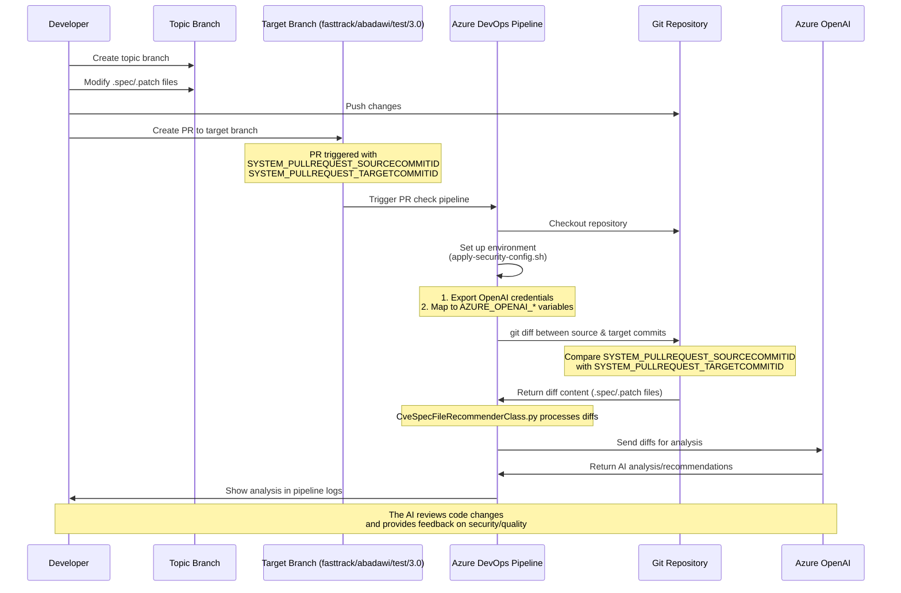
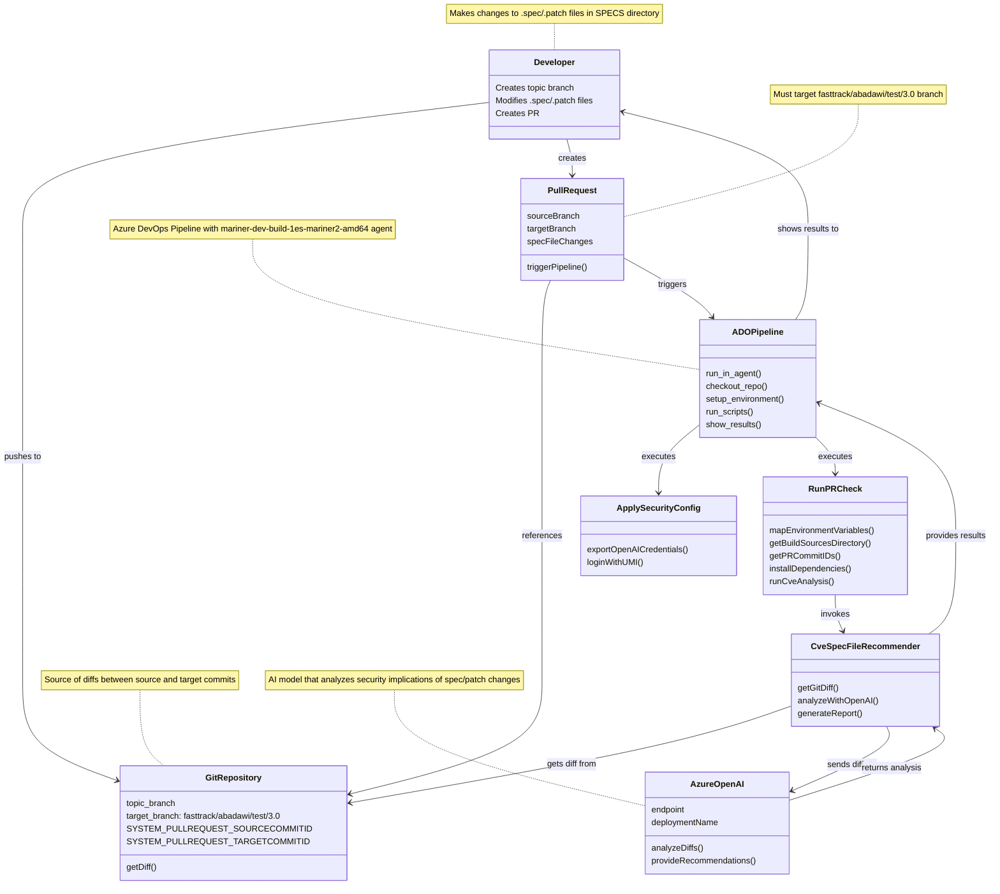

# Azure Linux PR Check Flow Diagrams

This file contains two different diagram styles to explain the PR check flow for Azure Linux SPEC/patch file reviews.

## 1. Sequence Diagram

This sequence diagram shows the temporal flow of actions and communications between components.

## 2. UML Class Diagram

This UML class diagram shows the structural relationships between components.

## Process Explanation

### 1. PR Creation Process
- Developer creates a branch from the target branch (`fasttrack/abadawi/test/3.0`)
- Developer modifies `.spec` or `.patch` files in the `SPECS` directory
- Developer creates a PR targeting `fasttrack/abadawi/test/3.0`
- ADO pipeline is triggered automatically when it detects these changes

### 2. Pipeline Execution Process
- The pipeline runs on the mariner-dev-build-1es-mariner2-amd64 agent
- `apply-security-config.sh` authenticates with UMI and exports OpenAI credentials
- `run-pr-check.sh` maps environment variables and prepares the environment
- Git diff is extracted between source and target commits
- `CveSpecFileRecommenderClass.py` sends the diffs to Azure OpenAI for analysis
- Results are displayed in the pipeline logs

### 3. Key Environment Variables
- `AZURE_OPENAI_ENDPOINT`: The Azure OpenAI API endpoint (mapped from OPENAI_API_BASE)
- `AZURE_OPENAI_DEPLOYMENT_NAME`: The deployment name (mapped from OPENAI_DEPLOYMENT_NAME)
- `SYSTEM_PULLREQUEST_SOURCECOMMITID`: The source commit ID of the PR
- `SYSTEM_PULLREQUEST_TARGETCOMMITID`: The target commit ID of the PR
- `BUILD_SOURCESDIRECTORY`: The directory containing the source code