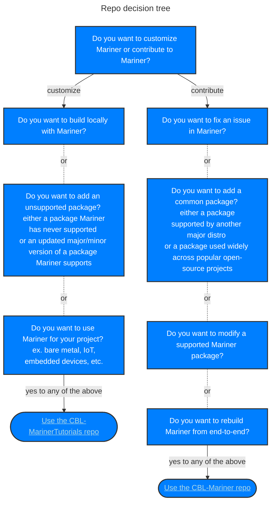

<!-- Table of Contents does not automatically update -->
# Contents
- [Contributing License Agreement](#contributing-license-agreement)
- [Security Vulnerabilities](#security-vulnerabilities)
- [Develop for CBL-Mariner](#develop-for-cbl-mariner)
  - [Choose a repo](#choose-a-repo)
  - [New Packages](#new-packages)
  - [Other contributions](#other-contributions)
  - [Building on CBL-Mariner](#building-on-cbl-mariner)
- [Pull Request Guidelines](#pull-request-guidelines)
  - [PR Titles](#pr-titles)
  - [PR Checklist](#pr-checklist)
- [Bugs](#bugs)

# Contributing License Agreement

This project welcomes contributions and suggestions. Most contributions require you to
agree to a Contributor License Agreement (CLA) declaring that you have the right to,
and actually do, grant us the rights to use your contribution. For details, visit
https://cla.microsoft.com.

When you submit a pull request, a CLA-bot will automatically determine whether you need
to provide a CLA and decorate the PR appropriately (e.g., label, comment). Simply follow the
instructions provided by the bot. You will only need to do this once across all repositories using our CLA.

This project has adopted the [Microsoft Open Source Code of Conduct](https://opensource.microsoft.com/codeofconduct/).
For more information see the [Code of Conduct FAQ](https://opensource.microsoft.com/codeofconduct/faq/)
or contact [opencode@microsoft.com](mailto:opencode@microsoft.com) with any additional questions or comments.

# Security Vulnerabilities

<!-- BEGIN MICROSOFT SECURITY.MD V0.0.3 BLOCK -->

## Security

Microsoft takes the security of our software products and services seriously, which includes all source code repositories managed through our GitHub organizations, which include [Microsoft](https://github.com/Microsoft), [Azure](https://github.com/Azure), [DotNet](https://github.com/dotnet), [AspNet](https://github.com/aspnet), [Xamarin](https://github.com/xamarin), and [our GitHub organizations](https://opensource.microsoft.com/).

If you believe you have found a security vulnerability in any Microsoft-owned repository that meets Microsoft's [Microsoft's definition of a security vulnerability](https://docs.microsoft.com/en-us/previous-versions/tn-archive/cc751383(v=technet.10)) of a security vulnerability, please report it to us as described below.

## Reporting Security Issues

**Please do not report security vulnerabilities through public GitHub issues.**

Instead, please report them to the Microsoft Security Response Center (MSRC) at [https://msrc.microsoft.com/create-report](https://msrc.microsoft.com/create-report).

If you prefer to submit without logging in, send email to [secure@microsoft.com](mailto:secure@microsoft.com).  If possible, encrypt your message with our PGP key; please download it from the the [Microsoft Security Response Center PGP Key page](https://www.microsoft.com/en-us/msrc/pgp-key-msrc).

You should receive a response within 24 hours. If for some reason you do not, please follow up via email to ensure we received your original message. Additional information can be found at [microsoft.com/msrc](https://www.microsoft.com/msrc).

Please include the requested information listed below (as much as you can provide) to help us better understand the nature and scope of the possible issue:

  * Type of issue (e.g. buffer overflow, SQL injection, cross-site scripting, etc.)
  * Full paths of source file(s) related to the manifestation of the issue
  * The location of the affected source code (tag/branch/commit or direct URL)
  * Any special configuration required to reproduce the issue
  * Step-by-step instructions to reproduce the issue
  * Proof-of-concept or exploit code (if possible)
  * Impact of the issue, including how an attacker might exploit the issue

This information will help us triage your report more quickly.

If you are reporting for a bug bounty, more complete reports can contribute to a higher bounty award. Please visit our [Microsoft Bug Bounty Program](https://microsoft.com/msrc/bounty) page for more details about our active programs.

## Preferred Languages

We prefer all communications to be in English.

## Policy

Microsoft follows the principle of [Coordinated Vulnerability Disclosure](https://www.microsoft.com/en-us/msrc/cvd).

<!-- END MICROSOFT SECURITY.MD BLOCK -->

# Develop for CBL-Mariner
## Choose a repo
The first step in developing with CBL-Mariner is to determine which repo fits your use case. If you are just looking to develop using CBL-Mariner's tools and packages, check out the [CBL-MarinerTutorials](https://github.com/microsoft/CBL-MarinerTutorials) repo. `CBL-MarinerTutorials` is geared towards creating custom CBL-Mariner builds rather than contributing to the tools or common tools. 

## New packages
New packages fall into one of three buckets: Mariner `SPECS`, Mariner `SPECS-EXTENDED`, or outside support. Mariner core (`SPECS`) includes full support and coverage. Packages in `SPECS-EXTENDED` are only guaranteed to compile successfully. Outside support means the package is not built or published by Mariner but instead by the user. Please see [CBL-MarinerTutorials](https://github.com/microsoft/CBL-MarinerTutorials) for building outside packages.

| Package Support Level | Builds | Published | CVE SLA | Restrictions 
|:----------------------|:-------|:----------|:--------|:------------
|SPECS                  |**Yes** |**Yes**    |**Yes**  | - have a viable upstream source which actively addresses CVEs <br> - not include project specific code <br> - have value for multiple use cases
|SPECS-EXTENDED         |**Yes** |**Yes**    |No       | - have a viable upstream source which actively addresses CVEs <br> - not include project specific code
|Outside                |No      |No         |No       | - no restrictions

---
## Other contributions
We also welcome all other types of contributions such as tooling and documentation improvements. Please adhere to the [Pull Request guidelines](pull-request-guidelines) when contributing.

## Building on CBL-Mariner
Please see either our [quickstart](toolkit/docs/quick_start/quickstart.md) or [building instructions](toolkit/docs/building/building.md) for technical instructions on developing for CBL-Mariner.
# Pull Request Guidelines
Please direct pull requests to the desired development branch ( main, 1.0-dev ). An overview of how the branches are configured can be seen below

| Branch / Tag | For PRs | Published | Notes
|:-------------|:--------|:----------|:------------
|main          |Yes       |No         | **Primary development branch**
|2.0           |No       |Yes - eventually   | Staging branch for publishing
|2.0-stable    |No       |  Yes      | Last published release
|2.0-preview   |No       |No         | Publishing in progress

| Branch / Tag | For PRs | Published | Notes
|:-------------|:--------|:----------|:------------
|1.0-dev       |Yes      |No         | Development branch for 1.0
|1.0           |No       |Yes - eventually    | Staging branch for publishing
|1.0-stable    |No       |Yes        | Last published release
|1.0-preview   |No       |No         | Publishing in progress

<br>

### PR Titles
PR titles should start with an action
```
- Add <package>
- Bump Mariner Release version for October Update
- Changed whatever you changed.
- Fix <thing you fixed> <reason you fixed it>
- Patch <package> to fix CVE-XXXX-YYYY, CVE-XXXX-YYYY…
- Upgrade <package> to version vvvv to fix CVE-XXXX-YYYY…
- Remove <package> <reason you removed it>
```

Please avoid titles such as
```
- package: <whatever you did to the package>
- CVE-XXXX-YYYY (leaving off what package was patched or upgraded)
- [1.0] (prefixing with branch or other information)
```

### PR Checklist
When creating your PR, please ensure the following:
- The toolchain has been rebuilt successfully (or no changes were made to it). This only applies if you changed any packages in the [toolchain package manifests](toolkit/resources/manifests/package). Specifically, `toolchain_x86_64.txt` and `toolchain_aarch64.txt`. For guidance building the toolchain, see our [building instructions](toolkit/docs/building/building.md).

- The [toolchain / worker package manifests](toolkit/resources/manifests/package) are up-to-date (versions match latest package versions in SPEC files). The manifests are the following files:
   - toolchain_x86_64.txt
   - toolchain_aarch64.txt
   - pkggen_core_x86_64.txt
   - pkggen_core_aarch64.txt

- Any updated packages successfully build (or no packages were changed). For guidance building packages, see our [building instructions](toolkit/docs/building/building.md). Please ensure the package is located in the [appropriate folder](#new-packages).

-  Packages depending on static components modified in this PR (Golang, *-static subpackages, etc.) have had their `Release` tag incremented. Dependent packages are packages which contain a `BuildRequires` on the package you are updating and create static links from your package. This can be difficult to discern based on spec files alone and may require investigating `make` commands in dependent packages or consulting a Mariner dev.

- Package tests (%check section) have been verified with RUN_CHECK=y for existing SPEC files, or added to new SPEC files. When running the check section, results will not fail a build. Check the logs for the results of this section. 

- All package sources are available. The sources are either in the source server or local folders `SPECS/<package>/SOURCES` or `SPECS/<package>`. While it is possible to build packages with all sources inside the repo, our policy is generally to have the source compressed and placed on the source server. Uploading to the source server can only be accomplished by a Mariner developer. Please request help in your PR for uploading your sources to the source server. To check the source server see https://cblmarinerstorage.blob.core.windows.net/sources/core/< source tar >.

- cgmanifest files are up-to-date and alphabetically sorted. The cgmanifest files are used to record all package sources. They include the following files:
    - ./cgmanifest.json
    - ./toolkit/tools/cgmanifest.json
    - ./toolkit/scripts/toolchain/cgmanifest.json,
    - .github/workflows/cgmanifest.json

  To validate, run the following in a CBL-Mariner container or Ubuntu >= 22.04    
  ```bash
  .github/workflows/validate-cg-manifest.sh SPECS/<package name>/<package-name>.spec
   ```
- LICENSE-MAP files are up-to-date. These files indicate which licenses are being used by CBL-Mariner's packages and where the package may be derived from. The license files include the following files:
  - ./SPECS/LICENSES-AND-NOTICES/data/licenses.json
  - ./SPECS/LICENSES-AND-NOTICES/LICENSES-MAP.md

  This can be checked by running
  ```bash
  python3 ./toolkit/scripts/license_map.py  \
  ./SPECS/LICENSES-AND-NOTICES/data/licenses.json \
  ./SPECS/LICENSES-AND-NOTICES/LICENSES-MAP.md \
  ./SPECS \
  ./SPECS-EXTENDED \
  ./SPECS-SIGNED
  ```
- All source files have up-to-date hashes in the *.signatures.json files. This hash is generated by `sha256sum`. You can also use the make tools to automatically update these hashes. 
   ```bash
   cd toolkit
   sudo make input-srpms REBUILD_TOOLS=y SRPM_FILE_SIGNATURE_HANDLING=update
   ```
- If you modified the go tools, ensure that the formatting meets golang's standards and that the tests still pass. 
   ```bash
   cd toolkit
   # fix formatting
   sudo make go-tidy-all
   # check tests
   sudo make go-test-coverage
   ```
- Documentation has been updated to match any changes to the build system. See [toolkit/docs](toolkit/docs).

## Bugs
If the bug is security related, please use the [security guidelines](#security-vulnerabilities) above. Please use the [issues page](https://github.com/microsoft/CBL-Mariner/issues) on CBL-Mariner to file any other bugs. Please include the requested information listed below (as much as you can provide) to help us better understand the nature and scope of the possible issue:
- Mariner Environment:
  - /etc/os-release
  - uname -a
- Steps to Repro:
- Expected Behavior:
- Actual Behavior:
