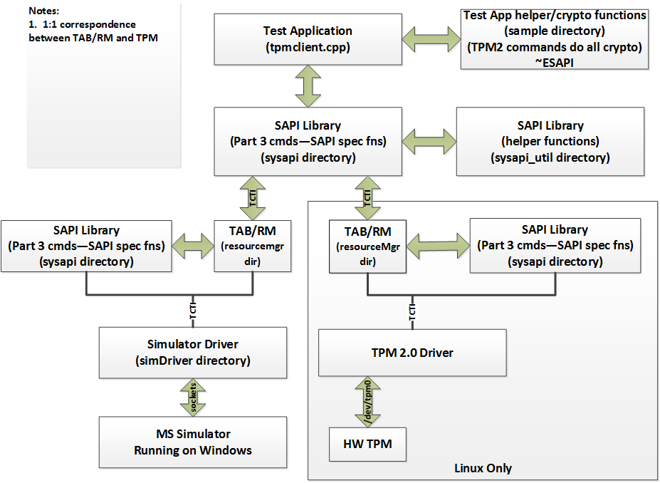

[](https://github.com/tpm2-software/tpm2-tss/actions)
[](https://ci.appveyor.com/project/williamcroberts/tpm2-tss)
[](https://cirrus-ci.com/github/tpm2-software/tpm2-tss)
[](https://scan.coverity.com/projects/tpm2-tss)
[](https://codecov.io/gh/tpm2-software/tpm2-tss)
[](https://bestpractices.coreinfrastructure.org/projects/2332)
[](https://lgtm.com/projects/g/tpm2-software/tpm2-tss/alerts/)
[](https://lgtm.com/projects/g/tpm2-software/tpm2-tss/context:cpp)
[](https://tpm2-tss.readthedocs.io/en/latest/?badge=latest)
[](https://bugs.chromium.org/p/oss-fuzz/issues/list?sort=-opened&can=1&q=proj:tpm2-tss)
[](https://gitter.im/tpm2-software/community?utm_source=badge&utm_medium=badge&utm_campaign=pr-badge)

# Overview
This repository hosts source code implementing the Trusted Computing Group's (TCG) TPM2 Software Stack (TSS).
This stack consists of the following layers from top to bottom:

* Feature API (FAPI) as described in the [TCG Feature API (FAPI) Specification](https://trustedcomputinggroup.org/wp-content/uploads/TSS_FAPI_v0p94_r09_pub.pdf)
along with [TCG TSS 2.0 JSON Data Types and Policy Language Specification](https://trustedcomputinggroup.org/wp-content/uploads/TSS_JSON_Policy_v0p7_r08_pub.pdf)
This API is designed to be very high-level API, intended to make programming with the TPM as simple as possible.
The API functions are exposed through a single library: libtss2-fapi.
* Enhanced System API (ESAPI) as described in the [TCG TSS 2.0 Enhanced System API (ESAPI) Specification](https://trustedcomputinggroup.org/wp-content/uploads/TSS_ESAPI_v1p0_r08_pub.pdf)
This API is a 1-to-1 mapping of the TPM2 commands documented in Part 3 of the TPM2 specification.
Additionally there are asynchronous versions of each command.
In addition to SAPI, the ESAPI performs tracking of meta data for TPM object and automatic calculation of session based authorization and encryption values.
Both the synchronous and asynchronous API are exposed through a single library: libtss2-esys.
* System API (SAPI) as described in the [TCG TSS 2.0 System Level API (SAPI) Specification](https://trustedcomputinggroup.org/wp-content/uploads/TSS_SAPI_v1p1_r29_pub_20190806.pdf)
This API is a 1-to-1 mapping of the TPM2 commands documented in Part 3 of the TPM2 specification.
Additionally there are asynchronous versions of each command.
These asynchronous variants may be useful for integration into event-driven programming environments.
Both the synchronous and asynchronous API are exposed through a single library: libtss2-sys.
* Marshaling/Unmarshaling (MU) as described in the [TCG TSS 2.0 Marshaling/Unmarshaling API Specification](https://trustedcomputinggroup.org/wp-content/uploads/TCG_TSS_Marshaling_Unmarshaling_API_v1p0_r07_pub.pdf)
This API provides a set of marshaling and unmarshaling functions for all data types define by the TPM library specification.
The Marshaling/Unmarshaling API is exposed through a library called libtss2-mu.
* TPM Command Transmission Interface (TCTI) as described in the [TCG TSS 2.0 TPM Command Transmission Interface (TCTI) API Specification](https://trustedcomputinggroup.org/wp-content/uploads/TCG_TSS_TCTI_v1p0_r18_pub.pdf).
This API provides a standard interface to transmit / receive TPM command / response buffers.
It is expected that any number of libraries implementing the TCTI API will be implemented as a way to abstract various platform specific IPC mechanisms.
Currently this repository provides several TCTI implementations: libtss2-tcti-device,
libtss2-tcti-tbs (for Windows), libtss2-tcti-swtpm and libtss2-tcti-mssim.
The former should be used for direct access to the TPM through the Linux kernel driver.
The latter implements the protocol exposed by the Microsoft software TPM2 simulator.
* The [TCG TSS 2.0 Overview and Common Structures Specification](https://trustedcomputinggroup.org/wp-content/uploads/TCG_TSS_Overview_Common_Structures_v0.9_r03_published.pdf) forms the basis for all implementations in this project. NOTE: We deviate from this specification by increasing the value of TPM2_NUM_PCR_BANKS from 3 to 16 to ensure compatibility with TPM2 implementations that have enabled a larger than typical number of PCR banks. This larger value for TPM2_NUM_PCR_BANKS is expected to be included in a future revision of the specification.

# Build and Installation Instructions:
Instructions to build and install tpm2-tss are available in the [INSTALL](INSTALL.md) file.

# Getting in Touch:
If you're looking to discuss the source code in this project or get some questions answered you should join the 01.org TPM2 mailing list:
  - https://lists.linuxfoundation.org/mailman/listinfo/tpm2

We also have an IRC channel set up on [FreeNode](https://freenode.net/) called \#tpm2.0-tss.
You can also try Gitter [](https://gitter.im/tpm2-software/community?utm_source=badge&utm_medium=badge&utm_campaign=pr-badge)

You can join a weekly online call at [TPM.dev](https://developers.tpm.dev/events/tpmdev-online-call), where we are discussing the tpm2-tss stack, the tpm2-pkcs11 project and other Linux TPM2 & TSS2-Software.

In case you want to contribute to the project, please also have a look at the [Contribution Guidelines](CONTRIBUTING.md).

# Documentation
The doxygen documentation can either be built by oneself (see the [INSTALL](INSTALL.md) file) or browsed directly on [tpm2-tss.readthedocs.io](https://tpm2-tss.readthedocs.io/).

# Test Suite
This repository contains a test suite intended to exercise the TCTI, SAPI and ESAPI code.
This test suite is *not* intended to test a TPM implementation, so this test suite should only be run against a TPM simulator.
If this test suite is executed against a TPM other than the software simulator it may cause damage to the TPM (NV storage wear out, etc.).
You have been warned.

## Simulator
The TPM library specification contains reference code sufficient to construct a software TPM 2.0 simulator.
This code was provided by Microsoft and they provide a binary download for Windows [here](https://www.microsoft.com/en-us/download/details.aspx?id=52507).

There are two implementations that enable building and running this code on Linux.
Issues building or running the simulator should be reported to respective project.

### Software TPM
The Software TPM is an open-source TPM emulator with different front-end interfaces such as socket and character device. Its code is hosted [on GitHub](https://github.com/stefanberger/swtpm) and building is faciliated by the GNU Autotools.
The TCTI module for using this simulator is called _swtpm_.

Since tpm2-tss v3.0 swtpm is the default simulator used by this project.

### IBM's Software Simulator
IBM has also repackaged this code with a few Makefiles so that the Microsoft code can be built and run on Linux systems.
The Linux version of the Microsoft TPM 2.0 simulator can be obtained
[on SourceForge](https://downloads.sourceforge.net/project/ibmswtpm2/ibmtpm974.tar.gz).
Once you've downloaded and successfully built and execute the simulator it will, by default, be accepting connections on the localhost, TCP ports 2321 and 2322.
The TCTI module for using this simulator is called _mssim_.

## Testing
To test the various TCTI, SAPI and ESAPI api calls, unit and integration tests can
be run by configuring the build to enable unit testing and running the "check"
build target. It is recommended to use a simulator for testing, and the
simulator will be automatically launched by the tests. Please review the
dependency list in [INSTALL](INSTALL.md) for dependencies when building
the test suite.
```
$ ./configure --enable-unit --enable-integration
$ make -j$(nproc) check
```
This will generate a file called "test-suite.log" in the root of the build
directory.

Please report failures in a Github 'issue' with a full log of the test run.

NOTE: The unit and integration tests can be enabled independently.
The --enable-unit option controls unit tests, and --enable-integration
controls the integration tests.

### Running tests on physical TPM device
To run integration tests on a physical TPM device, including a TPM hardware
or a software TPM implemented in platform firmware the configure script
provides two options.
The first option is called --with-device and it is used to point to the TPM
device interface exposed by the OS, for example:

```
  $ ./configure  --with-device=/dev/tpm0
```
The second option, --with-devicetests, enables a "class" of test.
There are three classes:
1. destructive - these tests can affect TPM capability or lifespan
2. mandatory   - these tests check all the functionality that is mandatory
                 per the TCG specification (default).
3. optional    - these tests are for functionality that is optional per the
                 TCG specification.

For example to enable both mandatory and optional test cases during configure
one needs to set this flag as follows:

```
  $ ./configure --with-devicetests="mandatory,optional"
```
Tht default value for the flag is "mandatory"
Any combination of the three is valid.
The two flags are only valid when the integration tests are enabled with
--enable-integration flag.

After that the following command is used to run the test on the configured
TPM device:

```
  $ sudo make check-device
```
  or
```
  $ sudo make check -j 1
```

Note: The tests can not be run in paralel.

### Running valgrind check
The unit and integration tests can be run under the valgrind tool, which
performs additional checks on the library and test code, such as memory
leak checks etc. The following command is used to run the tests under
valgrind:

  $ make check-valgrind

This command will enable all valgrind "tools" and kick off as many test
as they support. It is possible to enable different valgrind
tools (checks) in more granularity. This can be controlled by invoking
different tools separately using check-valgrind-&lt;tool&gt;, for instance:

```
  $ make check-valgrind-memcheck
```
  or
```
  $ make check-valgrind-drd
```

Currently the the following tools are supported:

memcheck - Performs memory related checks. This is the default tool.
helgrind - Performs synchronization errors checks.
drd      - Performs thread related checks.
sgcheck  - Performs stack overrun related checks.

Note that the valgring tool can also be invoked manually using the standard
libtool:

```
  $ libtool exec valgrind --tool=memcheck --leak-check=full \
    test/integration/esys-auto-session-flags.int
```

This allows for more control on what checks are performed.

### Logging
While investigating issues it might be helpful to enable extra debug/trace
output. It can be enabled separately for different components.
The description how to do this can be found in the [logging](doc/logging.md) file.

### Fuzzing
All system API function calls can be tested using a fuzzing library.
The description how to do this can be found in the [fuzzing](doc/fuzzing.md) file.

# Architecture/Block Diagram
SAPI library, TAB/RM, and Test Code Block Diagram:


# Project Layout
```
|-- doc     : various bits of documentation\
|-- include : header files installed in $(includedir)\
|   +-- tss2      : all public headers for this project\
|-- lib     : data files used by the build or installed into $(libdir)\
|-- m4      : autoconf support macros\
|-- man     : man pages\
|-- script  : scripts used by the build or CI\
|-- src     : all source files\
|   |-- tss2-esys : enhanced system API (ESAPI) implementation\
|   |   +-- api   : ESAPI TPM API implementation\
|   |-- tss2-mu   : TPM2 type marshaling/unmarshaling (MU) API implementation\
|   |-- tss2-sys  : system API (SAPI) implementation\
|   |   +-- api   : SAPI public API implementation\
|   |-- tss2-tcti : TCTI implementations for device and mssim\
|   +-- util      : Internal utility library (e.g. logging framework)\
+-- test    : test code\
    |-- integration : integration test harness and test cases\
    |-- tpmclient   : monolithic, legacy test application\
    +-- unit        : unit tests
```
