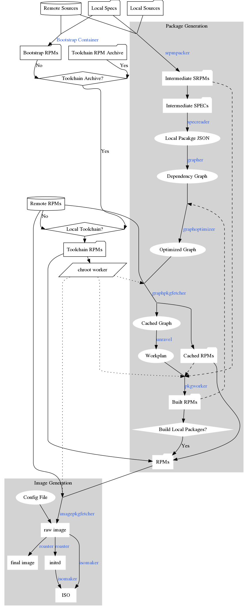

How The Build System Works
===
## Next: [Initial Prep](1_initial_prep.md)
## General Build Flow
Graph showing how the various build components interact.

Edges are marked with the tool used in blue when applicable.

The build process can be split into three components: tooling, package generation, and image generation.

### Tools
The tooling consists of a set of `Makefiles`, various go programs, a bootstrapping environment running in `Docker`, and a `chroot` environment to build in. These are discussed [here](1_initial_prep.md). The toolkit is able to re-build all of the tools from source if desired.

### Package Generation
Package generation is discussed in detail [here](2_local_packages.md) and [here](3_package_building.md). At a high level, the build system scans the local project directory for `*.spec` files which define the local packages. It then packages these files into `*.src.rpm` files by either including local source files, or downloading matching ones from a source server. The `*.src.rpm` files required for the currently selected configuration are then built in the correct order to resolve all dependencies. The build system will automatically download any build dependencies not satisfied by the local packages.

### Image Generation
Image generation is discussed in detail [here](4_image_generation.md). The image generation step creates a new filesystem, and then installs packages into it based on the currently selected configuration file. These packages can be either the locally built packages, or packages pulled from one or more package servers. Once the filesystem is composited any additional changes listed in the config file are made, the filesystem is then packaged into the requested format (`vhd`, `vhdx`, `ISO`, etc).

## In Depth Explanations
### [1. Initial Prep](1_initial_prep.md)
- Makefiles, Go Tooling, Toolchain, Chroots
### [2. Local Packages](2_local_packages.md)
- Local Spec Files, Creating Local SRPMs
### [3. Package Building](3_package_building.md)
- Dependency Graphing, Downloading Dependencies, Building Packages
### [4. Image Generation](4_image_generation.md)
- Composing Images, Creating ISOs
### [5. Misc](5_misc.md)
- Chroots