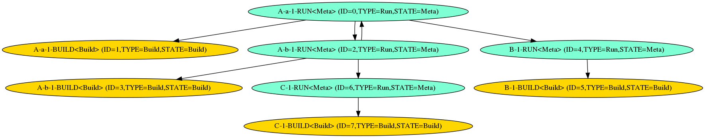
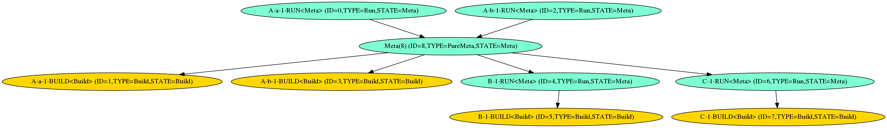

Building Packages
===
## Prev: [Local Packages](2_local_packages.md), Next: [Image Generation](4_image_generation.md)
## Initial Dependency Information
Once the intermediate SPEC files are extracted (see [Creating SPECS](#2_local_packages.md#creating_specs)) the dependency information from them needs to be extracted. The `specreader` tool scans each SPEC file in the intermediate SPECs folder and uses `rpmspec -q` to list the dependencies for each package found in the SPEC file. The tool operates inside of the `worker_chroot` (see [Chroot Worker](1_initial_prep.md#chroot_worker)).

Each SPEC file will have one base package, and may have additional virtual packages. Each of these packages is recorded as a `Provides` entry, along with a version and release if set.

All packages from a SPEC file share the same build requirements (as builds occur at the granularity of a SPEC file), but may have different run-time requirements. For each package a list of `BuildRequires` enumerates all the packages which much be available before building the current package. A `Requires` list similarly enumerates all the packages which must be available to install the package.

For example, a very simple SPEC may be parsed to give:
```json
{
    "Provides": {
        "Name": "example",
        "Version": "1.0.0-1.cm1",
        "Condition": "=",
        "SVersion": "",
        "SCondition": ""
    },
    "SrpmPath": "build/INTERMEDIATE_SRPMS/x86_64/example-1.0.0-1.cm1.src.rpm",
    "RpmPath": "out/RPMS/x86_64/example-1.0.0-1.x86_64.cm1.rpm",
    "SourceDir": "build/INTERMEDIATE_SPECS/example-1.0.0-1.cm1",
    "SpecPath": "build/INTERMEDIATE_SPECS/example-1.0.0-1.cm1/example.spec",
    "Architecture": "x86_64",
    "Requires": [
        {
            "Name": "nano",
            "Version": "",
            "Condition": "",
            "SVersion": "",
            "SCondition": ""
        }
    ],
    "BuildRequires": null
},
{
    "Provides": {
        "Name": "example-devel",
        "Version": "1.0.0-1.cm1",
        "Condition": "=",
        "SVersion": "",
        "SCondition": ""
    },
    "SrpmPath": "build/INTERMEDIATE_SRPMS/x86_64/example-1.0.0-1.cm1.src.rpm",
    "RpmPath": "out/RPMS/x86_64/example-devel-1.0.0-1.x86_64.cm1.rpm",
    "SourceDir": "build/INTERMEDIATE_SPECS/example-1.0.0-1.cm1",
    "SpecPath": "build/INTERMEDIATE_SPECS/example-1.0.0-1.cm1/example.spec",
    "Architecture": "x86_64",
    "Requires": null,
    "BuildRequires": null
}
```
The single SPEC provides the base package `example`, but also provides a virtual package `example-devel`. Both packages share the same input files and build requirements, and will be produced as a single atomic operation.

All package dependency information is written to `./../build/pkg_artifacts/specs.json`.

### Rich dependencies
Spec files can have `(a <condition> b)` style requirements. Depending on the condition the following will happen:
- `and`, `or`, `with`: the build system will record both options into the graph so that all possible requirements will be made available to pick from during package install allowing for maximum flexibility. This means that the build system requires all optional RPMs to be available to build/download even if they will not be used for a specific configuration.
- `if`: the build will record the requirement on the left side of the clause as a dependency. That means that the build system will require the package to be available to build/download even if it will not be used for a specific configuration.
- `else`, `unless`, `without`, or multiple clauses of any kind: unsupported, the build will fail with an error.

#### Warning:
The build system will print a warning when it encounters a rich dependency. If the build fails, make sure all conditional packages are following the guidelines from the message or remove the unavailable conditional packages from the SPEC file.

## Dependency Graphing

A critical component of package building is ensuring that the packages are built in such a way that:
1) no package build is started before its build dependencies are available
2) no package is used as a dependency before its run-time requirements are satisfied

### Types of Nodes
The graph contains several types of nodes, with various states. As the graph is processed by each tool nodes are updated, pruned, or added as needed.
#### TypeLocalBuild
> This represents a local package which may be passed to the build worker to generate an RPM from.
> It can be either:
>
> `StateBuild`: Should be built
>
> `StateBuildError`: Package had all of its dependencies satisfied but failed to build for other reasons.
>
> `StateUpToDate`: Package is already available locally

#### TypeLocalRun
> This node represents a package which is may be installed or used as a dependency.
> Run nodes are always:
>
> `StateMeta`: Organizational node used to impose ordering on other nodes

#### TypeGoal
> Special node which is used to group packages together. If the goal node is satisfied then all the packages which are part of the goal are available to install.
> Goal nodes are always:
>
> `StateMeta`: Organizational node used to impose ordering on other nodes

#### TypeRemoteRun
> This node represents a package which is unknown to the local build system, but has been requested as a dependency. It will need to be resolved from a remote source. `TypeRemote` nodes are considered equivalent to `TypeRun` nodes in most cases.
> Remote nodes may be either:
>
> `StateUnresolved`: No known source has been found yet
>
> `StateCached`: A remote source was found and the package should now be available locally.

#### TypePureMeta
> This is a purely organizational node with no special meaning. Used to do things like resolve intra-package cycles which would normally break the dependency graph.
> PureMeta nodes are always:
>
> `StateMeta`: Organizational node used to impose ordering on other nodes

### File Format
The graphs are exported as `graphviz` `dot` formatted files. These files are exported in such a way as to offer enough human readable information to help debugging.

The files can be ingested into the `graphviz` tools to visualize them, although the graphs of a large build are often impractically large.
```bash
# Visualize the file 'graph.dot' using the basic dot tool
dot -Tpng -o visualized.png < graph.dot
```

### Dynamic versioning
We have a versionsprocessor tool that iterates over all Specs and writes their release and versions into a macro file in a format of
`azl_<package_name>_release`, `azl_<package_name>_version`, note that the `<package_name>` needs any `-` are replaced with `_` due to macros not allowing `-`.

### Stage 1: Grapher

The `grapher` tool reads the `specs.json` file and converts it into an acyclic directed graph. Inter-package dependencies are represented by directed edges in the graph.

The `grapher` tool outputs `./../build/pkg_artifacts/graph.dot`

#### Graph Generation

Each `provides` entry in `specs.json` is converted to two vertices in the graph, a `build` node and a `run` node. Each node represents exactly one package (with specific version if available). Two packages cannot both provide a node with the same name and version (same name with different versions is fine).

Edges in the graph represent dependencies. A package cannot be installed (`run`) until it has been compiled (`build`). An edge is automatically added from the `run` node to the `build` node of each package to represent this dependency.

Once all packages have been added to the graph, the inter-package dependencies are added. For each `BuildRequires` in a package an edge is created from the current `build` node to the `run` node associated with the required package. The same is done for each `Requires`, but from the current `run` node instead of the `build` node.

Edges will not be created for `Requires` between two `run` nodes that have the same `RpmPath` since the dependency will automatically be met when the rpm is installed. If the edges were created it could introduce extra cycles that would need to be solved.

#### Package Lookup
A critical part of adding edges is finding the correct node to connect to. Package dependencies can specify their requirements with varying levels of detail. The most basic dependency is just a package name. The dependency can be further refined by setting a limit on the version (`Requires: example >= 1.0.0`), or double conditionals (`Requires: example >= 1.0.0`, `Requires: example < 2.0.0 `). A dependency can also require a specific version (`Requires: example = 1.0.0`)

The `grapher` program will try to find the best matching package it knows about to satisfy dependencies. To assist with this a set of sorted lookup lists are maintained for each package, storing every version encountered so far. The highest version package which satisfies the requirements is selected. If no node in the lookup list satisfies the version requirements an unresolved node is added to the graph.

##### Version Compare
Versions are split into two components: the version and the release number. Generally packages do not specify a specific release number in their requirements, so the release is not considered unless both versions under comparison explicitly contain one.

Versions are stored internally as intervals with maximum and minimum supported versions (versions must be a single range, ex. `ver < 3, ver > 4` is not supported). Each interval records an upper and lower bound. Those bounds may be inclusive or exclusive depending on the version comparison operator (`<, <=, =, >=, >`)

#### Cycle Resolving
In general cycles in the dependency graph are considered an unrecoverable error, but there are special cases where they can be fixed. Some packages create cycles with their own virtual packages which are not an issue. Since all the packages from a given SPEC file build at the same time the fact they rely on each other is not a problem.

To solve this a `TypePureMeta` node is inserted which consolidates all the dependencies of the cycle nodes into a single node. The nodes in the cycle are then disconnected from each other and instead depend on the new meta node. This only works if all the nodes in the cycle are from the same SPEC file, and the dependencies are all run-time dependencies.

In the example below nodes `A-a` and `A-b` are from the same spec file and require each other. Since they are part of the same package this cycle can be fixed. A meta node (`ID=8`) is added which consolidates all the requirements. Notice that `A-a` required `B`, while `A-b` required `C`. Now the meta node requires both `B` and `C` and the two `A` packages require the meta node instead.




#### Dynamic Dependencies
There exists `provides` that are not known until a package is built. For example, package `bar` may provide `pkgconfig(bar)` but this information is only known after `bar` has been built. This type of provide is called an **implicit provide** . If a package takes a dependency on an implicit provide, it is called a **dynamic dependency**.

The existence of dynamic dependencies will result in a graph that may not be solvable until packages are built and the graph knows their implicit provides. The `scheduler` tool handles this logic.


#### Default Goal Node
The `grapher` tool automatically adds an "ALL" goal node to the graph which links to every node. Building this node will cause every known package to be built.


### Stage 2: Graphpkgfetcher
The `graphpkgfetcher` tool's job is to resolve unresolved remote nodes. Unresolved nodes occur when a local package has `Requires` or `BuildRequires` which are not available from another local package.

The tool uses the `worker_chroot` (see [Chroot Worker](1_initial_prep.md#chroot_worker)) to locate packages. The worker will search in five locations:

1. the local chroot environment,
2. already built RPMs in `./../out/RPMS/`,
3. the upstream base repository,
4. the upstream preview repository if `$(USE_PREVIEW_REPO)` is set to `y`, and
5. any remote repo listed in `REPO_LIST ?=`.

If `$(DISABLE_UPSTREAM_REPOS)` is set to `y`, any repo that is accessed through the network is disabled.

The worker will run the `tdnf` command to search for each missing package. `tdnf` will prioritize local packages over pulling them from a remote location.

The worker is able to access the local packages through a mounted overlay in the chroot environment, and output newly cached RPMs through another writable mount. For `tdnf` to read the local packages the folder must be converted into a repository, but since it is mounted as an overlay the changes are not persisted out of the chroot.

Once the packages are cached they are copied into `./../out/RPMs` for use in further stages of the build and any satisfied nodes are marked as `StateCached`.

The `graphpkgfetcher` tool outputs `./../build/pkg_artifacts/cached_graph.dot`

### Stage 3: Scheduler
The `scheduler` tool's job is to walk the dependency graph and build every specified package and their dependencies.

`scheduler` controls a pool of build agents (`pkgworker`). It starts at the leaf nodes of the dependency graph and processes every node. Only processing `build` nodes causes srpms to be built. Other node types are effectively NoOps, only processed to enforce dependency ordering.

`scheduler` will avoid building an srpm if it detects the package has already been built, and all of its build dependencies were also prebuilt. If any build dependencies of an SRPM needed to be built, then that SRPM will be built regardless.

`scheduler` supports dynamic dependencies. These are dependencies a package has on an implicit provide from another package. For example, package `foo` may `Requires: pkgconfig(bar)`. When `grapher` runs it is not known which package will provide `pkgconfig(bar)`. It is only known after packages are built and one of them reports that it provides `pkgconfig(bar)`. To handle this `scheduler` analyzes every rpm built for these implicit provides. If it finds one that is needed by another package in the graph it will modify the graph's nodes and edges so that it reflects this new information.

During the build `scheduler` will continually try to optimize the build graph. When the graph is first loaded, `scheduler` walks the dependencies of every package that needs to be built. If it does not find any dynamic dependencies it will create a subgraph that only contains the needed packages.
If there are dynamic dependencies found then the graph cannot be subgraphed as the `scheduler` does not know which package in the graph, if any, will satisfy this dynamic dependency. As the `scheduler` fills in information about implicit provides during the build, it will continuously attempt to create a solvable subgraph and finish building using that.

The `scheduler` tool outputs the final state of the dependency graph to `./../build/pkg_artifacts/built_graph.dot`.

### Stage 4: Pkgworker
The `pkgworker` tool is not invoked directly by the build system. Instead it is invoked from the `scheduler` tool.
`pkgworker` uses the `worker_chroot` (see [Chroot Worker](1_initial_prep.md#chroot_worker)) environment to build each package independently. First it creates an empty folder to build in (one for each package to build) and extracts the chroot archive into it. This preps the environment with all the toolchain packages which were made available during the prep stage (see [Toolchain](1_initial_prep.md#toolchain)). It then mounts the local RPM folder into the environment so the worker can access any build dependencies it has. Using `tdnf` the worker installs the build dependencies from the local packages, then using `rpmbuild` it builds the specified package. Once the build is complete the freshly built packages are placed into the `./../out/RPMS/` folder so that they are available to future workers.

## Prev: [Initial Prep](2_local_packages.md), Next: [Image Generation](4_image_generation.md)
